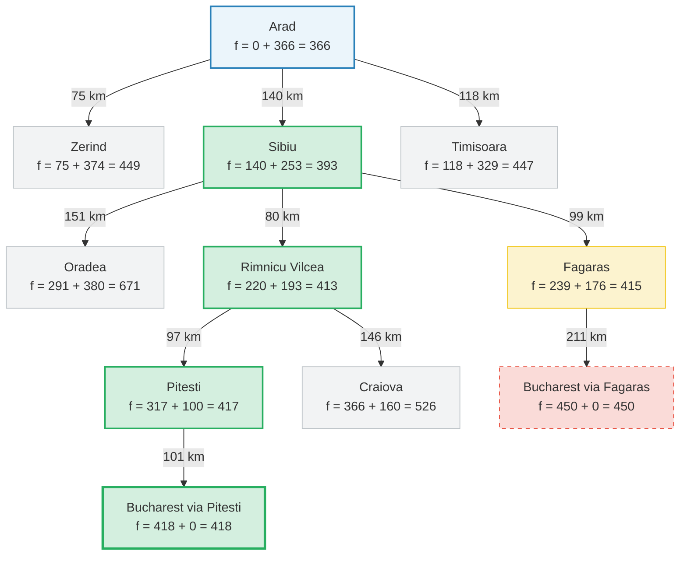

## Procura A*
Este repositório contém a implementação em Python do algoritmo de Procura A* aplicado ao clássico problema de navegação no mapa da Roménia (Capítulo 3 do livro Inteligência Artificial: Uma Abordagem Moderna, de Stuart Russell e Peter Norvig).

## 🧠 Como Funciona a Procura A*?
A Procura A* é um dos métodos de procura informada mais populares e eficientes da Inteligência Artificial. Ao contrário da Procura Gulosa (que apenas olha para o futuro), o A* combina a informação do caminho já percorrido com a estimativa do que falta percorrer.  
A sua função de avaliação é definida como:  
f(n) = g(n) + h(n)  
  
Onde:  
g(n): É o custo real acumulado das estradas desde a cidade de origem até ao nó atual n.  
h(n): É a estimativa heurística (distância em linha reta) do nó atual n até ao objetivo (Bucareste).  
f(n): É o custo total estimado do caminho mais curto que passa pelo nó n.  

## 🏆 Garantia de Otimalidade
O algoritmo A* é completo e ótimo (garante sempre encontrar o caminho mais curto real), desde que a função heurística h(n) seja admissível (nunca superestime o custo real até ao destino) e consistente. Como a distância em linha reta é sempre menor ou igual à distância por estrada, a nossa heurística cumpre este requisito perfeitamente.

## 🛠️ Análise Estrutural do Código
Para implementar a lógica do A*, a estrutura de dados da fronteira foi expandida para rastrear o progresso histórico:  
Fronteira (fronteira): Uma lista de tuplas contendo (valor_f, custo_g, cidade_atual, caminho_percorrido).  
Cálculo de Custos Dinâmico: Ao expandir os vizinhos de uma cidade, o custo acumulado é atualizado:  
novo_g = g_atual + custo_estrada
novo_f = novo_g + heuristica[vizinho]


Ordenação Inteligente  
A tomada de decisão baseia-se na ordenação da fronteira pelo menor valor estimado global de f(n):  
  
Ordena a fronteira pelo menor valor f(n) = g(n) + h(n)  
```fronteira.sort(key=lambda x: x[0])```


## 🚀 Como Executar o Código
Pré-requisitos  
Python 3.x instalado no seu sistema.  
Instruções  
Guarde o código fornecido num ficheiro chamado busca_A-Estrela.py e execute o seguinte comando no terminal:

```
python busca_A-Estrela.py
```

## 📊 Árvore de Decisão Visual (Origem: Arad -> Destino: Bucharest)
O diagrama abaixo ilustra como o algoritmo A* avalia os nós na fronteira. Os nós verdes representam a rota ótima final determinada matematicamente pelo algoritmo (f = 418 km). Note que caminhos como Fagaras foram inicialmente considerados, mas acabaram por ser preteridos por terem um custo acumulado total superior ao de Pitesti:



Passo a Passo da Decisão: 
```
1. Partida (Arad): Apenas Arad na fronteira. Ao expandir, gera Sibiu (f=393), Timisoara (f=447) e Zerind (f=449). O menor f é Sibiu.
2. Expandir Sibiu: Gera novas rotas para Fagaras (f=415) e Rimnicu Vilcea (f=413). A fronteira agora tem Rimnicu Vilcea (413), Fagaras (415), Timisoara (447) e Zerind (449). O menor é Rimnicu Vilcea.
3. Expandir Rimnicu Vilcea: Gera rota para Pitesti (f=417). A fronteira tem Fagaras (415) e Pitesti (417). O menor é Fagaras.
4. Expandir Fagaras: Encontra um caminho para Bucareste com custo total de f = 450 km. Este caminho é guardado na fronteira, mas não é selecionado porque temos um nó mais barato: Pitesti (417).
5. Expandir Pitesti: Encontra um caminho alternativo para Bucareste com custo total de f = 418 km.
6. Fim: No passo seguinte, o caminho por Pitesti (418 km) é removido por ser o mais barato de toda a fronteira. O teste de objetivo é satisfeito e o caminho ótimo é devolvido.
```
Caminho Final:
``` Arad -> Sibiu -> Rimnicu Vilcea -> Pitesti -> Bucharest (Custo total: 418 km)```


📊 Propriedades do Algoritmo
| Propriedade | Classificação | Explicação |
|-------------|---------------|------------|
| Completo? | Sim | Garante encontrar uma solução se ela existir (em grafos com ramificação finita). |
| Ótimo? | Sim | Garante encontrar a rota com o menor custo real possível (418 km vs 450 km da gulosa). |
| Complexidade de Tempo | O(b^d) | Depende diretamente da qualidade da heurística. No pior caso, é exponencial. |
| Complexidade de Espaço |O(b^d) |Mantém todos os nós gerados em memória, o que pode ser um fator limitante em mapas gigantescos. |


